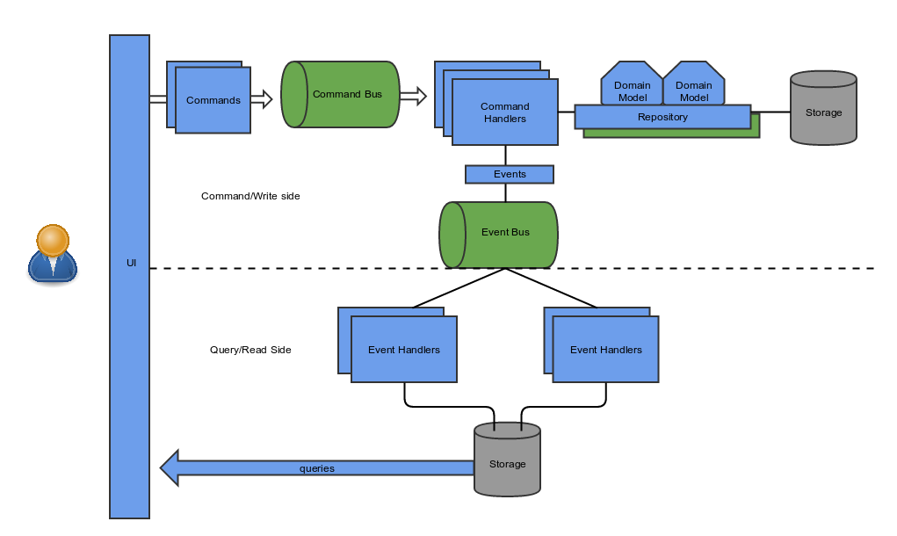

# Todo application in CQRS, Event Sourcing and ddd architecture

## Technology

Axon Framework 
Java 8
Spring Boot 2
Swagger 2
H2 / JPA

Currently, the project has no UI, testing is only through Swagger. In the future I will add frontends in AngularJs, maybe :)

Test  http://localhost:port/swagger-ui.html

## How to run

run using mvn spring-boot:run

## Architecture diagram

